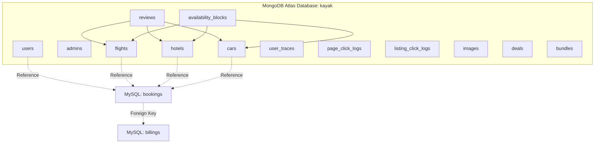
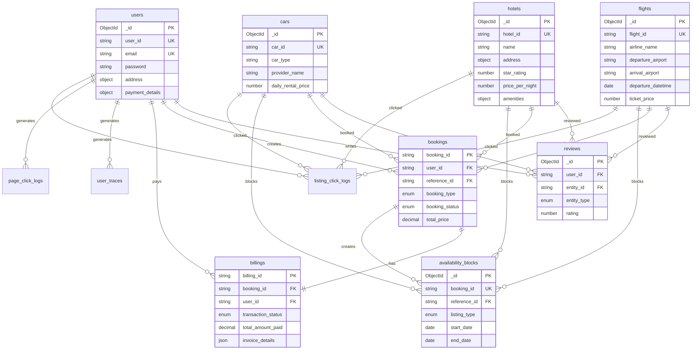
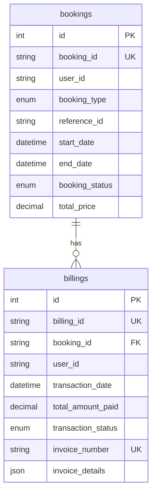
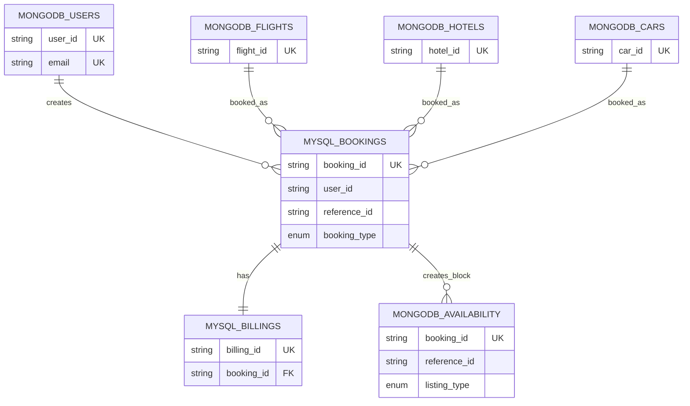

# Kayak Travel Platform - Database Schema Documentation

## Table of Contents
1. [Database Architecture Overview](#database-architecture-overview)
2. [MongoDB Collections](#mongodb-collections)
3. [MySQL Tables](#mysql-tables)
4. [Entity Relationship Diagrams](#entity-relationship-diagrams)
5. [Indexes and Performance](#indexes-and-performance)
6. [Data Relationships](#data-relationships)
7. [Schema Details](#schema-details)

---

## Database Architecture Overview

The Kayak Travel Platform uses a **hybrid database architecture** combining MongoDB and MySQL to leverage the strengths of each database system:

- **MongoDB Atlas (Cloud)**: Flexible document-based storage for reference data, user profiles, listings, and analytics
- **MySQL 8.0 (Local/Docker)**: ACID-compliant relational database for transactional data (bookings and billing)
- **Redis Cache**: In-memory caching layer for performance optimization

### Database Selection Rationale

| Data Type | Database | Reason |
|-----------|----------|--------|
| Users, Admins | MongoDB | Flexible schema, easy profile updates |
| Flights, Hotels, Cars | MongoDB | Varied structures, search optimization |
| Reviews, Logs | MongoDB | Document-based, flexible metadata |
| Bookings | MySQL | ACID transactions, referential integrity |
| Billings | MySQL | Financial data, ACID compliance, foreign keys |

---

## MongoDB Collections

### Collection Overview



---

## Schema Details

### 1. users Collection

**Purpose**: Store user account information and profiles

**Schema**:
```javascript
{
  _id: ObjectId,                    // MongoDB auto-generated
  user_id: String,                 // SSN format: ###-##-#### (unique, required)
  email: String,                   // Unique, lowercase, required
  password: String,               // Hashed with bcrypt (10 rounds), required
  first_name: String,             // Required
  last_name: String,              // Required
  address: {
    street: String,               // Required
    city: String,                 // Required
    state: String,                 // Required (US state)
    zip: String                   // Required (##### or #####-####)
  },
  phone_number: String,            // Required
  profile_image_url: String,      // Optional
  payment_details: {              // Optional
    card_token: String,
    masked_number: String,
    card_type: String,            // Required if payment_details exists
    expiry_month: Number,         // 1-12, required if payment_details exists
    expiry_year: Number           // >= 2020, required if payment_details exists
  },
  refresh_token: String,           // JWT refresh token, optional
  created_at: Date,               // Auto-generated
  updated_at: Date                // Auto-updated on save
}
```

**Indexes**:
- `user_id` (unique)
- `email` (unique)
- `created_at`

**Validation Rules**:
- `user_id`: Must match regex `/^\d{3}-\d{2}-\d{4}$/`
- `email`: Standard email format validation
- `password`: Minimum 8 characters, at least one uppercase, one lowercase, one special character
- `state`: Valid US state abbreviation or full name
- `zip`: Format `#####` or `#####-####`

**Service**: User Service (Port 3001)

---

### 2. admins Collection

**Purpose**: Store administrator accounts with role-based access

**Schema**:
```javascript
{
  _id: ObjectId,                    // MongoDB auto-generated
  admin_id: String,                 // Unique, uppercase, required
  email: String,                   // Unique, lowercase, required
  password: String,                // Hashed with bcrypt (10 rounds), required
  first_name: String,              // Required
  last_name: String,               // Required
  address: {
    street: String,                // Required
    city: String,                  // Required
    state: String,                 // Required
    zip: String                    // Required
  },
  phone_number: String,            // Required
  role: String,                    // Enum: 'Super Admin', 'Listing Admin', 
                                    // 'User Admin', 'Billing Admin', 'Analytics Admin'
                                    // Default: 'Analytics Admin'
  reports_and_analytics_managed: [String],  // Array of report IDs, default: []
  refresh_token: String,           // JWT refresh token, optional
  created_at: Date,               // Auto-generated
  updated_at: Date                // Auto-updated on save
}
```

**Indexes**:
- `admin_id` (unique)
- `email` (unique)
- `role`
- `created_at`

**Service**: User Service (Port 3001), Admin Analytics Service (Port 3006)

---

### 3. flights Collection

**Purpose**: Store flight listings and availability

**Schema**:
```javascript
{
  _id: ObjectId,                    // MongoDB auto-generated
  flight_id: String,                // Unique, uppercase, required (e.g., "FL001")
  airline_name: String,             // Required (e.g., "American Airlines")
  departure_airport: String,       // Required, uppercase (e.g., "JFK")
  departure_city: String,           // Optional (e.g., "New York")
  arrival_airport: String,          // Required, uppercase (e.g., "LAX")
  arrival_city: String,             // Optional (e.g., "Los Angeles")
  departure_datetime: Date,         // Required
  arrival_datetime: Date,           // Required
  duration_minutes: Number,          // Required, min: 0
  flight_class: String,             // Enum: 'Economy', 'Business', 'First', required
  ticket_price: Number,            // Required, min: 0
  total_available_seats: Number,    // Required, min: 0
  rating: Number,                   // Default: 0, min: 0, max: 5
  created_at: Date,                 // Auto-generated
  updated_at: Date                  // Auto-updated on save
}
```

**Indexes**:
- `flight_id` (unique)
- Compound: `departure_airport`, `arrival_airport`, `departure_datetime`
- `departure_city`
- `arrival_city`
- `departure_datetime`
- `rating`

**Service**: Listing Service (Port 3002)

---

### 4. hotels Collection

**Purpose**: Store hotel listings with amenities and ratings

**Schema**:
```javascript
{
  _id: ObjectId,                    // MongoDB auto-generated
  hotel_id: String,                 // Unique, required (e.g., "HTL001")
  name: String,                     // Required (e.g., "Grand Hotel")
  address: {
    street: String,                 // Required
    city: String,                   // Required
    state: String,                  // Required
    zip: String                     // Required
  },
  star_rating: Number,              // Required, min: 1, max: 5
  number_of_rooms: Number,          // Required, min: 1
  default_room_type: String,         // Required (e.g., "Standard", "Deluxe")
  price_per_night: Number,          // Required, min: 0
  amenities: {
    wifi: Boolean,                  // Default: false
    breakfast_included: Boolean,     // Default: false
    parking: Boolean,                // Default: false
    pet_friendly: Boolean,          // Default: false
    near_transit: Boolean,          // Default: false
    pool: Boolean,                  // Default: false
    gym: Boolean                    // Default: false
  },
  hotel_rating: Number,             // Default: 0, min: 0, max: 5
  created_at: Date,                 // Auto-generated
  updated_at: Date                  // Auto-updated on save
}
```

**Indexes**:
- `hotel_id` (unique)
- Compound: `address.city`, `price_per_night`
- `star_rating`
- `hotel_rating`
- Compound: `amenities.pet_friendly`, `amenities.wifi`

**Service**: Listing Service (Port 3002)

---

### 5. cars Collection

**Purpose**: Store car rental listings

**Schema**:
```javascript
{
  _id: ObjectId,                    // MongoDB auto-generated
  car_id: String,                   // Unique, required (e.g., "CAR001")
  car_type: String,                 // Required (e.g., "Economy", "SUV", "Luxury")
  provider_name: String,            // Required (e.g., "Hertz", "Enterprise")
  model: String,                    // Required (e.g., "Toyota Camry")
  year: Number,                     // Required, min: 1900, max: current year + 1
  transmission_type: String,       // Required (e.g., "Automatic", "Manual")
  number_of_seats: Number,          // Required, min: 1
  daily_rental_price: Number,      // Required, min: 0
  car_rating: Number,              // Default: 0, min: 0, max: 5
  availability_status: String,     // Enum: 'Available', 'Booked', 'Maintenance', 'Unavailable'
                                    // Default: 'Available'
  pickup_city: String,              // Required
  created_at: Date,                 // Auto-generated
  updated_at: Date                  // Auto-updated on save
}
```

**Indexes**:
- `car_id` (unique)
- Compound: `pickup_city`, `daily_rental_price`, `car_type`
- `availability_status`
- `car_rating`

**Service**: Listing Service (Port 3002)

---

### 6. availability_blocks Collection

**Purpose**: Cache booking availability for fast search queries (denormalized from MySQL bookings)

**Schema**:
```javascript
{
  _id: ObjectId,                    // MongoDB auto-generated
  listing_type: String,             // Enum: 'Flight', 'Hotel', 'Car', required, indexed
  reference_id: String,             // Listing ID (flight_id, hotel_id, car_id), required, indexed
  start_date: Date,                 // Required, indexed
  end_date: Date,                   // Required, indexed
  booking_id: String,               // MySQL booking_id, required, indexed, unique
  booking_status: String,           // Enum: 'Pending', 'Confirmed', 'Cancelled', 'PaymentFailed'
                                    // Required, indexed
  user_id: String,                  // User SSN, required
  quantity: Number,                 // Default: 1, min: 1 (for capacity tracking)
  created_at: Date,                 // Auto-generated
  updated_at: Date                  // Auto-updated on save
}
```

**Indexes**:
- Compound: `listing_type`, `reference_id`, `start_date`, `end_date`
- Compound: `listing_type`, `reference_id`, `booking_status`
- `start_date`, `end_date`
- `booking_id` (unique)

**Service**: Listing Service (Port 3002) - Synchronized via Kafka events from Booking Service

**Note**: This is a cache/denormalized view. Source of truth is MySQL `bookings` table.

---

### 7. reviews Collection

**Purpose**: Store user reviews and ratings for flights, hotels, and cars

**Schema**:
```javascript
{
  _id: ObjectId,                    // MongoDB auto-generated
  user_id: String,                 // User SSN, required
  user_ref: ObjectId,               // Reference to users._id, required
  entity_type: String,              // Enum: 'Flight', 'Hotel', 'Car', required
  entity_id: String,                // Listing ID (flight_id, hotel_id, car_id), required
  rating: Number,                   // Required, min: 1, max: 5
  title: String,                    // Required, maxlength: 200
  comment: String,                  // Required, maxlength: 2000
  created_at: Date                  // Auto-generated
}
```

**Indexes**:
- Compound: `entity_type`, `entity_id`
- `user_id`
- `created_at` (descending)

**Service**: Review/Logging Service (Port 3005)

---

### 8. user_traces Collection

**Purpose**: Track user behavior and activity traces

**Schema**:
```javascript
{
  _id: ObjectId,                    // MongoDB auto-generated
  user_id: String,                 // User SSN, optional
  cohort_key: String,              // Cohort identifier, optional
  events: [{                        // Array of trace events
    type: String,                   // Event type, required
    data: Mixed,                    // Event data (flexible), default: {}
    timestamp: Date                 // Event timestamp, default: Date.now
  }],
  created_at: Date,                 // Auto-generated
  updated_at: Date                 // Auto-updated on save
}
```

**Indexes**:
- `user_id`
- `cohort_key`
- `created_at`

**Service**: Review/Logging Service (Port 3005)

---

### 9. page_click_logs Collection

**Purpose**: Log page-level click events for analytics

**Schema**:
```javascript
{
  _id: ObjectId,                    // MongoDB auto-generated
  user_id: String,                 // User SSN, optional
  page: String,                    // Page identifier, required
  element_id: String,              // Clicked element ID, required
  timestamp: Date                   // Auto-generated
}
```

**Indexes**:
- `timestamp`
- `user_id`
- `page`

**Service**: Review/Logging Service (Port 3005)

---

### 10. listing_click_logs Collection

**Purpose**: Log listing click events for analytics

**Schema**:
```javascript
{
  _id: ObjectId,                    // MongoDB auto-generated
  user_id: String,                 // User SSN, required
  listing_type: String,            // Enum: 'Flight', 'Hotel', 'Car', required
  listing_id: String,              // Listing ID, required
  timestamp: Date                  // Auto-generated
}
```

**Indexes**:
- `timestamp`
- `user_id`
- Compound: `listing_type`, `listing_id`

**Service**: Review/Logging Service (Port 3005)

---

### 11. images Collection

**Purpose**: Store image metadata for listings and reviews

**Schema**:
```javascript
{
  _id: ObjectId,                    // MongoDB auto-generated
  entity_type: String,             // Enum: 'Flight', 'Hotel', 'Room', 'Car', required
  entity_id: String,               // Entity ID, required
  image_url: String,                // Image URL, required
  metadata: Mixed,                  // Flexible metadata object, default: {}
  created_at: Date                 // Auto-generated
}
```

**Indexes**:
- Compound: `entity_type`, `entity_id`

**Service**: Review/Logging Service (Port 3005)

---

### 12. deals Collection (Recommendation Service)

**Purpose**: Store AI-generated deals and promotions

**Schema** (Python Pydantic Model):
```python
{
  _id: String,                      // Optional (MongoDB ObjectId)
  listing_type: String,             // Enum: "Flight", "Hotel", required
  listing_id: String,               // Listing ID, required
  date_range: {
    start: Date,                    // Required
    end: Date                        // Required
  },
  base_price: Number,              // Required
  current_price: Number,           // Required
  avg_30d_price: Number,           // Optional
  deal_score: Number,              // Required, 0-100
  limited_availability: Boolean,   // Default: false
  tags: Object,                     // Flexible tags object, default: {}
  seats_or_rooms_left: Number,     // Optional
  created_at: Date,                 // Optional
  updated_at: Date                 // Optional
}
```

**Service**: Agentic Recommendation Service (Port 8000)

---

### 13. bundles Collection (Recommendation Service)

**Purpose**: Store AI-generated bundle recommendations (Flight + Hotel + Car)

**Schema** (Python Pydantic Model):
```python
{
  flight: {
    flight_id: String,
    airline: String,
    price: Number,
    departure: Date,
    arrival: Date
  },
  hotel: {
    hotel_id: String,
    name: String,
    price_per_night: Number,
    total_nights: Number,
    total_price: Number,
    amenities: Object
  },
  total_price: Number,
  fit_score: Number,                // 0-100
  why_this: String,                 // Max 250 chars
  what_to_watch: String,            // Max 120 chars
  created_at: Date,
  updated_at: Date
}
```

**Service**: Agentic Recommendation Service (Port 8000)

---

## MySQL Tables

### Database: kayak_db

**Character Set**: utf8mb4  
**Collation**: utf8mb4_unicode_ci  
**Engine**: InnoDB

---

### 1. bookings Table

**Purpose**: Store all booking records with ACID compliance

**Schema**:
```sql
CREATE TABLE bookings (
    id INT AUTO_INCREMENT PRIMARY KEY,
    booking_id VARCHAR(255) NOT NULL UNIQUE,
    user_id VARCHAR(255) NOT NULL,
    user_ref VARCHAR(255),
    booking_type ENUM('Flight', 'Hotel', 'Car') NOT NULL,
    reference_id VARCHAR(255) NOT NULL,
    reference_ref VARCHAR(255),
    start_date DATETIME NOT NULL,
    end_date DATETIME NOT NULL,
    booking_status ENUM('Pending', 'Confirmed', 'Cancelled', 'PaymentFailed') 
        NOT NULL DEFAULT 'Pending',
    total_price DECIMAL(10, 2) NOT NULL CHECK (total_price >= 0),
    created_at TIMESTAMP DEFAULT CURRENT_TIMESTAMP,
    updated_at TIMESTAMP DEFAULT CURRENT_TIMESTAMP ON UPDATE CURRENT_TIMESTAMP,
    
    INDEX idx_user_booking (user_id, booking_type, booking_status),
    INDEX idx_booking_type_ref (booking_type, reference_id),
    INDEX idx_booking_status (booking_status),
    INDEX idx_created_at (created_at)
) ENGINE=InnoDB DEFAULT CHARSET=utf8mb4 COLLATE=utf8mb4_unicode_ci;
```

**Field Descriptions**:
- `id`: Auto-increment primary key
- `booking_id`: Unique booking identifier (format: `BK` + timestamp + random)
- `user_id`: User SSN (references MongoDB users.user_id)
- `user_ref`: MongoDB users._id (ObjectId as string)
- `booking_type`: Type of booking (Flight, Hotel, or Car)
- `reference_id`: Listing ID (flight_id, hotel_id, or car_id)
- `reference_ref`: MongoDB listing._id (ObjectId as string)
- `start_date`: Booking start date/time
- `end_date`: Booking end date/time
- `booking_status`: Current status of the booking
- `total_price`: Total booking price (non-negative)
- `created_at`: Record creation timestamp
- `updated_at`: Record update timestamp (auto-updated)

**Indexes**:
- Primary Key: `id`
- Unique: `booking_id`
- Composite: `user_id`, `booking_type`, `booking_status` (for user booking queries)
- Composite: `booking_type`, `reference_id` (for availability checks)
- `booking_status` (for status filtering)
- `created_at` (for time-based queries)

**Service**: Booking Service (Port 3003)

---

### 2. billings Table

**Purpose**: Store payment transactions with ACID compliance

**Schema**:
```sql
CREATE TABLE billings (
    id INT AUTO_INCREMENT PRIMARY KEY,
    billing_id VARCHAR(255) NOT NULL UNIQUE,
    user_id VARCHAR(255) NOT NULL,
    user_ref VARCHAR(255),
    booking_type VARCHAR(50) NOT NULL,
    booking_id VARCHAR(255) NOT NULL,
    booking_ref VARCHAR(255),
    transaction_date DATETIME NOT NULL DEFAULT CURRENT_TIMESTAMP,
    total_amount_paid DECIMAL(10, 2) NOT NULL CHECK (total_amount_paid >= 0),
    payment_method VARCHAR(100) NOT NULL,
    transaction_status ENUM('Success', 'Failed', 'Refunded', 'Pending') 
        NOT NULL DEFAULT 'Pending',
    invoice_number VARCHAR(255) NOT NULL UNIQUE,
    invoice_details JSON,
    created_at TIMESTAMP DEFAULT CURRENT_TIMESTAMP,
    updated_at TIMESTAMP DEFAULT CURRENT_TIMESTAMP ON UPDATE CURRENT_TIMESTAMP,
    
    FOREIGN KEY (booking_id) REFERENCES bookings(booking_id) ON DELETE CASCADE,
    INDEX idx_transaction_date (transaction_date),
    INDEX idx_user_id (user_id),
    INDEX idx_transaction_status (transaction_status),
    INDEX idx_booking_billing (booking_id, booking_type)
) ENGINE=InnoDB DEFAULT CHARSET=utf8mb4 COLLATE=utf8mb4_unicode_ci;
```

**Field Descriptions**:
- `id`: Auto-increment primary key
- `billing_id`: Unique billing identifier (format: `BILL` + timestamp + random)
- `user_id`: User SSN (references MongoDB users.user_id)
- `user_ref`: MongoDB users._id (ObjectId as string)
- `booking_type`: Type of booking (Flight, Hotel, or Car)
- `booking_id`: Foreign key to bookings.booking_id
- `booking_ref`: MongoDB booking reference (if stored in MongoDB)
- `transaction_date`: Transaction timestamp
- `total_amount_paid`: Amount paid (non-negative)
- `payment_method`: Payment method (e.g., 'credit_card', 'debit_card', 'paypal')
- `transaction_status`: Current transaction status
- `invoice_number`: Unique invoice number (format: `INV` + timestamp + random)
- `invoice_details`: JSON object containing:
  ```json
  {
    "line_items": [
      {
        "description": "Flight Booking",
        "quantity": 1,
        "unit_price": 299.99,
        "total": 299.99
      }
    ],
    "subtotal": 299.99,
    "tax": 23.99,
    "total": 323.98
  }
  ```
- `created_at`: Record creation timestamp
- `updated_at`: Record update timestamp (auto-updated)

**Indexes**:
- Primary Key: `id`
- Unique: `billing_id`, `invoice_number`
- Foreign Key: `booking_id` → `bookings.booking_id` (CASCADE on delete)
- `transaction_date` (for date range queries)
- `user_id` (for user billing queries)
- `transaction_status` (for status filtering)
- Composite: `booking_id`, `booking_type` (for booking-billing joins)

**Service**: Billing Service (Port 3004)

---

## Entity Relationship Diagrams

### MongoDB Collections Relationships



### MySQL Tables Relationships



### Cross-Database Relationships



---

## Indexes and Performance

### MongoDB Indexes Summary

| Collection | Indexes | Purpose |
|------------|---------|---------|
| users | `user_id` (unique), `email` (unique), `created_at` | Fast user lookup, email validation |
| admins | `admin_id` (unique), `email` (unique), `role`, `created_at` | Admin authentication, role filtering |
| flights | `flight_id` (unique), compound search indexes | Fast search by route and date |
| hotels | `hotel_id` (unique), city/price compound, amenities | Fast search by location and filters |
| cars | `car_id` (unique), city/price/type compound | Fast search by location and type |
| availability_blocks | Multiple compound indexes | Fast availability conflict detection |
| reviews | `entity_type` + `entity_id`, `user_id`, `created_at` | Fast review retrieval |
| user_traces | `user_id`, `cohort_key`, `created_at` | User behavior analysis |
| page_click_logs | `timestamp`, `user_id`, `page` | Analytics queries |
| listing_click_logs | `timestamp`, `user_id`, `listing_type` + `listing_id` | Listing popularity analysis |

### MySQL Indexes Summary

| Table | Indexes | Purpose |
|-------|---------|---------|
| bookings | Primary key, `booking_id` (unique), composite indexes | Fast booking lookup, user queries, availability checks |
| billings | Primary key, `billing_id` (unique), `invoice_number` (unique), foreign key, date/user/status indexes | Fast billing lookup, transaction queries, reporting |

### Performance Optimization Strategies

1. **MongoDB**:
   - Compound indexes for common query patterns
   - Unique indexes for data integrity
   - TTL indexes for automatic cleanup (optional)

2. **MySQL**:
   - Composite indexes for multi-column queries
   - Foreign key indexes for join performance
   - Date indexes for time-based queries

3. **Redis Cache**:
   - TTL-based expiration (60s for bookings, 1 hour for billings)
   - Pattern-based cache invalidation
   - Graceful degradation on cache failure

---

## Data Relationships

### User → Booking → Billing Flow

```
User (MongoDB)
  ↓ (user_id: SSN)
Booking (MySQL)
  ↓ (booking_id)
Billing (MySQL) [Foreign Key]
```

### Listing → Booking → Availability Block Flow

```
Flight/Hotel/Car (MongoDB)
  ↓ (reference_id: flight_id/hotel_id/car_id)
Booking (MySQL)
  ↓ (Kafka event: booking_created)
Availability Block (MongoDB) [Cache]
```

### Review Relationships

```
User (MongoDB)
  ↓ (user_id)
Review (MongoDB)
  ↓ (entity_type, entity_id)
Flight/Hotel/Car (MongoDB)
```

### Cross-Database References

- **MongoDB → MySQL**: 
  - `bookings.user_id` references `users.user_id` (SSN)
  - `bookings.reference_id` references `flights.flight_id`, `hotels.hotel_id`, or `cars.car_id`
  - `billings.user_id` references `users.user_id` (SSN)

- **MySQL → MongoDB**:
  - `bookings.user_ref` stores MongoDB `users._id` (ObjectId as string)
  - `bookings.reference_ref` stores MongoDB listing `_id` (ObjectId as string)
  - `billings.user_ref` stores MongoDB `users._id` (ObjectId as string)

---

## Data Consistency

### Synchronization Mechanisms

1. **Availability Blocks**:
   - Source of Truth: MySQL `bookings` table
   - Cache: MongoDB `availability_blocks` collection
   - Sync: Kafka events (`booking_created`, `booking_confirmed`, `booking_cancelled`)
   - Service: Listing Service consumes events and updates cache

2. **Booking Status**:
   - Source of Truth: MySQL `bookings.booking_status`
   - Updates: Via Billing Service transaction (ACID compliance)
   - Events: Kafka events for cross-service synchronization

3. **User References**:
   - MongoDB `users._id` stored in MySQL as `user_ref`
   - Used for MongoDB queries from MySQL services
   - Maintained during booking creation

---

## Schema Evolution

### Versioning Strategy

- **MongoDB**: Flexible schema allows adding fields without migration
- **MySQL**: Schema changes require migration scripts
- **Backward Compatibility**: New fields are optional, existing queries remain valid

### Migration Considerations

1. **MongoDB Collections**: Add new fields gradually, validate in application layer
2. **MySQL Tables**: Use `ALTER TABLE` with proper transaction handling
3. **Indexes**: Add indexes during low-traffic periods
4. **Data Migration**: Use Kafka events for data synchronization during migrations

---

## Data Validation Rules

### MongoDB Validation

- **Application-Level**: Mongoose schemas enforce validation
- **Database-Level**: Unique indexes enforce uniqueness constraints
- **Custom Validators**: SSN format, email format, state validation

### MySQL Validation

- **Column Constraints**: ENUM types, CHECK constraints, NOT NULL
- **Foreign Keys**: Referential integrity enforced
- **Unique Constraints**: Prevent duplicate booking_id, billing_id, invoice_number
- **Application-Level**: Additional validation in service layer

---

## Backup and Recovery

### MongoDB Atlas

- **Automated Backups**: Provided by MongoDB Atlas
- **Point-in-Time Recovery**: Available in paid tiers
- **Replication**: Automatic replica sets

### MySQL

- **Manual Backups**: `mysqldump` for database backups
- **Binary Logs**: Enable for point-in-time recovery
- **Replication**: Master-slave replication for high availability

### Redis

- **Persistence**: AOF (Append-Only File) enabled in docker-compose
- **Cache Nature**: Data can be regenerated from databases

---

## Security Considerations

### Data Protection

1. **Passwords**: Hashed with bcrypt (10 rounds), never stored in plain text
2. **SSN**: Stored as user_id, validated format, not encrypted (consider encryption for production)
3. **Payment Details**: Tokenized, masked numbers only
4. **JWT Tokens**: Signed with secret, short expiry times

### Access Control

1. **Database Access**: Service-specific credentials
2. **Network Security**: MongoDB Atlas IP whitelisting
3. **Connection Encryption**: TLS/SSL for all database connections
4. **Query Parameterization**: SQL injection prevention

---

**Document Version**: 1.0  
**Last Updated**: 2024  
**Maintained By**: Kayak Travel Platform Development Team

