# Kayak Travel Platform - Complete Database Schema Diagram

## Single Comprehensive Database Schema Diagram

This is the complete Database Schema Diagram showing all MongoDB collections and MySQL tables with their relationships.

```mermaid
erDiagram
    %% MongoDB Collections - User Management
    users {
        ObjectId _id PK
        string user_id UK "SSN format"
        string email UK
        string password "hashed"
        string first_name
        string last_name
        object address
        string phone_number
        string profile_image_url
        object payment_details
        string refresh_token
        date created_at
        date updated_at
    }
    
    admins {
        ObjectId _id PK
        string admin_id UK
        string email UK
        string password "hashed"
        string first_name
        string last_name
        object address
        string phone_number
        string role "enum"
        array reports_and_analytics_managed
        string refresh_token
        date created_at
        date updated_at
    }
    
    %% MongoDB Collections - Listings
    flights {
        ObjectId _id PK
        string flight_id UK
        string airline_name
        string departure_airport
        string departure_city
        string arrival_airport
        string arrival_city
        date departure_datetime
        date arrival_datetime
        number duration_minutes
        string flight_class "enum"
        number ticket_price
        number total_available_seats
        number rating
        date created_at
        date updated_at
    }
    
    hotels {
        ObjectId _id PK
        string hotel_id UK
        string name
        object address
        number star_rating
        number number_of_rooms
        string default_room_type
        number price_per_night
        object amenities
        number hotel_rating
        date created_at
        date updated_at
    }
    
    cars {
        ObjectId _id PK
        string car_id UK
        string car_type
        string provider_name
        string model
        number year
        string transmission_type
        number number_of_seats
        number daily_rental_price
        number car_rating
        string availability_status "enum"
        string pickup_city
        date created_at
        date updated_at
    }
    
    %% MongoDB Collections - Availability & Bookings
    availability_blocks {
        ObjectId _id PK
        string listing_type "enum"
        string reference_id
        date start_date
        date end_date
        string booking_id UK
        string booking_status "enum"
        string user_id
        number quantity
        date created_at
        date updated_at
    }
    
    %% MongoDB Collections - Reviews & Logging
    reviews {
        ObjectId _id PK
        string user_id
        ObjectId user_ref FK
        string entity_type "enum"
        string entity_id
        number rating "1-5"
        string title
        string comment
        date created_at
    }
    
    user_traces {
        ObjectId _id PK
        string user_id
        string cohort_key
        array events
        date created_at
        date updated_at
    }
    
    page_click_logs {
        ObjectId _id PK
        string user_id
        string page
        string element_id
        date timestamp
    }
    
    listing_click_logs {
        ObjectId _id PK
        string user_id
        string listing_type "enum"
        string listing_id
        date timestamp
    }
    
    images {
        ObjectId _id PK
        string entity_type "enum"
        string entity_id
        string image_url
        object metadata
        date created_at
    }
    
    %% MongoDB Collections - Recommendations
    deals {
        ObjectId _id PK
        string listing_type "enum"
        string listing_id
        object date_range
        number base_price
        number current_price
        number avg_30d_price
        number deal_score
        boolean limited_availability
        object tags
        number seats_or_rooms_left
        date created_at
        date updated_at
    }
    
    bundles {
        ObjectId _id PK
        object flight
        object hotel
        number total_price
        number fit_score
        string why_this
        string what_to_watch
        date created_at
        date updated_at
    }
    
    %% MySQL Tables - Transactions
    bookings {
        int id PK
        string booking_id UK
        string user_id "SSN"
        string user_ref "MongoDB ObjectId"
        string booking_type "enum"
        string reference_id
        string reference_ref "MongoDB ObjectId"
        datetime start_date
        datetime end_date
        string booking_status "enum"
        decimal total_price
        timestamp created_at
        timestamp updated_at
    }
    
    billings {
        int id PK
        string billing_id UK
        string user_id "SSN"
        string user_ref "MongoDB ObjectId"
        string booking_type
        string booking_id FK
        string booking_ref "MongoDB ObjectId"
        datetime transaction_date
        decimal total_amount_paid
        string payment_method
        string transaction_status "enum"
        string invoice_number UK
        json invoice_details
        timestamp created_at
        timestamp updated_at
    }
    
    %% Relationships - User Management
    users ||--o{ reviews : "writes"
    users ||--o{ bookings : "creates"
    users ||--o{ billings : "pays"
    users ||--o{ user_traces : "generates"
    users ||--o{ page_click_logs : "generates"
    users ||--o{ listing_click_logs : "generates"
    
    %% Relationships - Listings to Bookings
    flights ||--o{ bookings : "booked_as"
    hotels ||--o{ bookings : "booked_as"
    cars ||--o{ bookings : "booked_as"
    
    %% Relationships - Listings to Reviews
    flights ||--o{ reviews : "reviewed"
    hotels ||--o{ reviews : "reviewed"
    cars ||--o{ reviews : "reviewed"
    
    %% Relationships - Listings to Availability
    flights ||--o{ availability_blocks : "blocks"
    hotels ||--o{ availability_blocks : "blocks"
    cars ||--o{ availability_blocks : "blocks"
    
    %% Relationships - Listings to Click Logs
    flights ||--o{ listing_click_logs : "clicked"
    hotels ||--o{ listing_click_logs : "clicked"
    cars ||--o{ listing_click_logs : "clicked"
    
    %% Relationships - Bookings to Billings (MySQL Foreign Key)
    bookings ||--|| billings : "has"
    
    %% Relationships - Bookings to Availability Blocks
    bookings ||--o{ availability_blocks : "creates"
    
    %% Relationships - Listings to Deals
    flights ||--o{ deals : "has_deals"
    hotels ||--o{ deals : "has_deals"
```



---

## Database Schema Overview

### MongoDB Collections (13 Collections)

**User Management:**
- `users` - User accounts and profiles
- `admins` - Administrator accounts with roles

**Listings:**
- `flights` - Flight listings
- `hotels` - Hotel listings
- `cars` - Car rental listings

**Availability & Synchronization:**
- `availability_blocks` - Cached booking availability (synced from MySQL)

**Reviews & Analytics:**
- `reviews` - User reviews and ratings
- `user_traces` - User behavior tracking
- `page_click_logs` - Page-level click analytics
- `listing_click_logs` - Listing click analytics
- `images` - Image metadata

**Recommendations:**
- `deals` - AI-generated deals
- `bundles` - Flight + Hotel + Car bundles

### MySQL Tables (2 Tables)

**Transactions:**
- `bookings` - All booking records (ACID compliant)
- `billings` - Payment transactions with foreign key to bookings

---

## Key Relationships

1. **Users → Bookings → Billings**
   - Users create bookings (stored in MySQL)
   - Bookings have associated billings (foreign key relationship)

2. **Listings → Bookings**
   - Flights, Hotels, Cars can be booked
   - Reference stored in MySQL bookings table

3. **Bookings → Availability Blocks**
   - When booking created, availability block synced to MongoDB
   - Enables fast search filtering

4. **Users → Reviews**
   - Users write reviews for listings
   - Reviews reference both user and listing

5. **Cross-Database References**
   - MySQL stores MongoDB ObjectIds as strings (`user_ref`, `reference_ref`)
   - Enables joining data across databases

---

## Database Architecture

- **MongoDB Atlas**: Cloud database for flexible, document-based data
- **MySQL 8.0**: Local/Docker database for ACID-compliant transactions
- **Hybrid Approach**: Best of both worlds - flexibility + transaction integrity

---

## How to Use This Diagram

1. **Copy the Mermaid code** above (everything between the ```mermaid markers)
2. **Go to [Mermaid Live Editor](https://mermaid.live)**
3. **Paste the code** into the editor
4. **Export as PNG or SVG** using the download button
5. **Use in your documentation**

---

**This is the complete Database Schema Diagram showing all collections, tables, fields, and relationships for the entire Kayak Travel Platform.**

