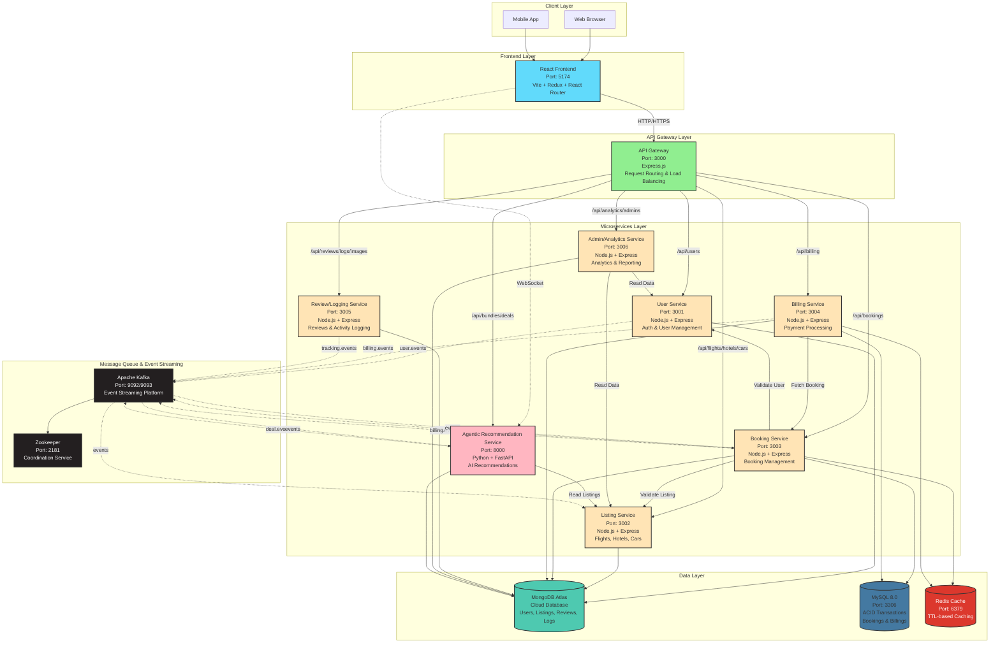

# Kayak Travel Platform - Complete System Architecture Design Diagram

## Single Comprehensive Architecture Diagram

This is the complete System Architecture Design Diagram for the entire Kayak Travel Platform project.



---

## Architecture Components

### Frontend Layer
- **React Frontend** (Port 5174): Single-page application built with React 18, Vite, Redux Toolkit, and React Router
- **WebSocket Connection**: Real-time event updates via WebSocket to Recommendation Service

### API Gateway Layer
- **API Gateway** (Port 3000): Single entry point routing all requests to appropriate microservices
- Routes requests based on path prefixes (`/api/users`, `/api/flights`, etc.)

### Microservices Layer
1. **User Service** (3001): Authentication, user registration, JWT token management
2. **Listing Service** (3002): Flight, hotel, and car listings with search and availability
3. **Booking Service** (3003): ACID-compliant booking management with MySQL
4. **Billing Service** (3004): Payment processing and invoice generation
5. **Review/Logging Service** (3005): User reviews, ratings, and activity logging
6. **Admin/Analytics Service** (3006): Analytics, reporting, and admin operations
7. **Agentic Recommendation Service** (8000): AI-powered recommendations and WebSocket broadcasting

### Message Queue & Event Streaming
- **Apache Kafka** (9092/9093): Event streaming platform for asynchronous communication
- **Zookeeper** (2181): Coordination service for Kafka
- **Event Topics**: `user.events`, `booking.events`, `billing.events`, `deal.events`, `tracking.events`

### Data Layer
- **MongoDB Atlas**: Cloud database for users, listings, reviews, logs (flexible schema)
- **MySQL 8.0**: Relational database for bookings and billings (ACID compliance)
- **Redis Cache**: In-memory cache for performance optimization (TTL-based expiration)

### Communication Patterns
- **HTTP/HTTPS**: Synchronous request/response via API Gateway
- **WebSocket**: Real-time bidirectional communication for live updates
- **Kafka Events**: Asynchronous event-driven communication between services
- **Service-to-Service**: Direct HTTP calls for validation and data fetching

---

## How to Use This Diagram

1. **Copy the Mermaid code** above (everything between the ```mermaid markers)
2. **Go to [Mermaid Live Editor](https://mermaid.live)**
3. **Paste the code** into the editor
4. **Export as PNG or SVG** using the download button
5. **Use in your documentation**

The diagram shows:
- ✅ All 8 microservices with ports and technologies
- ✅ Complete data flow (HTTP, WebSocket, Kafka events)
- ✅ All databases and their purposes
- ✅ Message queue architecture
- ✅ Service-to-service communication
- ✅ Color-coded components for easy identification

---

**This is the complete System Architecture Design Diagram for the entire Kayak Travel Platform.**

